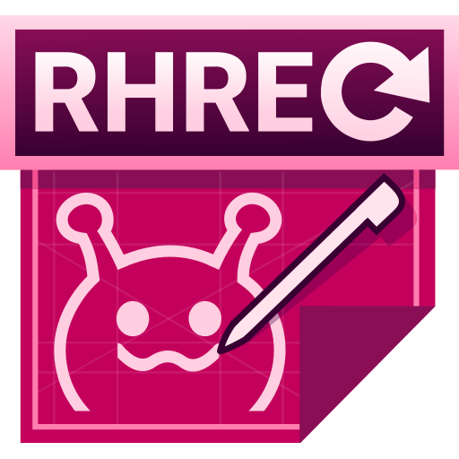
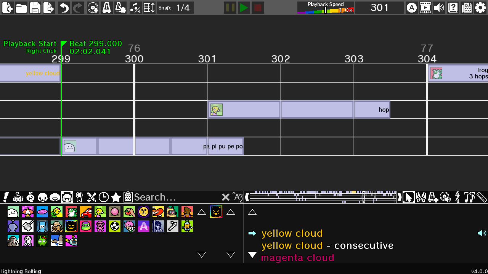

# Rhythm Heaven Remix Editor Refresh (RHREfresh)
*A custom remix audio editor for the [Rhythm Heaven](https://en.wikipedia.org/wiki/Rhythm_Heaven_Megamix) series.*

### [Download the latest release here!](https://github.com/TheAlternateDoctor/RhythmHeavenRemixEditorRefresh/releases/latest)

  

**Rhythm Heaven Remix Editor Refresh** is a fork of RHRE (based on [RHRE3](https://github.com/chrislo27/RhythmHeavenRemixEditor)) with many improvements and new features! Some of those include...
* **Minigames from Rhythm Heaven Groove**
* A cleaner editor layout
* Completely remade UI and minigame icons
* Boxes to type in the starting tempo & music start offset
* A new settings menu with new options
* An EXE version, and MacOS support
* And of course, bugfixes!

Also check out the [RHREfresh SFX Database](https://github.com/TheAlternateDoctor/RHRE-database).

## Features

* Drag-and-drop common Rhythm Heaven cues, patterns, and sounds into your remix!
* All main Rhythm Heaven minigames are here, with plenty of side games too!
* Export your remixes in a variety of audio formats!
* Place inputs on the timeline to play along!
* Change the look of the program with the theme editor!
* Add your own minigames with custom sound pack support!
* Automatic SFX database updating, so your remixes always sound great!

## System Requirements
### **EXE Version** (Windows only)
* Windows 10 or newer
* An internet connection to download the SFX Database

### **JAR Version** (Windows, Mac, and Linux)
* [Java 17](https://www.oracle.com/java/technologies/javase/jdk17-archive-downloads.html) or [newer](https://www.oracle.com/java/technologies/downloads/), and an OS that can run your chosen version
* An internet connection to download the SFX Database

## Installation
### **EXE Version** (Windows only)
1. Go to the [most recent release](https://github.com/chrislo27/RhythmHeavenRemixEditor/releases/latest) and download the `RHREfresh_X_exe.zip` file, where `X` is the current version number.
2. Fully extract the zip file to a location you prefer. `RHREfresh.exe` AND the `jdk` folder must be in the same folder.
3. Double-click ``RHREfresh.exe`` to open the program! If you see a popup that says "Windows protected your PC", click "More info" and then "Run anyway".
4. Let the program download the necessary data from the SFXDB. You'll see something along the lines of "Receiving objects" while it loads. This may take up to several minutes.
5. Have fun remixing!

### **JAR Version** (Windows, Mac, and Linux)
1. Go to the [most recent release](https://github.com/chrislo27/RhythmHeavenRemixEditor/releases/latest) and download the `RHREfresh_X_jar.zip` file, where `X` is the current version number.
2. Fully extract the zip file to a location you prefer. All files must be extracted.
3. Depending on your operating system, run the following file:
* **Windows**: Double-click ``run_windows.bat``. If it asks if you'd like to run the file, click "Run".
* **Mac**: Open Terminal, drag in the ``run_macos.sh`` file, and hit [Enter].
* **Linux**: Run the ``run_linux.sh`` file.
4. Let the program download the necessary data from the SFXDB. You'll see something along the lines of "Receiving objects" while it loads. This may take up to several minutes.
5. Have fun remixing!

## Updating the program
### From RHREfresh:
RHREfresh will automatically check for updates when it opens. Simply follow the on-screen instructions!
* For the **EXE version**, RHREfresh will automatically re-open once the update is complete.
* For the **JAR version**, you will have to re-open RHREfresh manually after the update is finished installing.

You can also check for updates at any time in the Info and Settings page of Settings by clicking "View editor version info", or update manually by downloading the latest release with the instructions above. 

### From RHRE3:
Simply follow the installation instructions above. RHREfresh will automatically move over your settings, themes, and other data.
* Custom SFX will **NOT** be transferred! Make sure they don't have any conflicts with the built-in SFX (for example, a custom SFX pack for Rhythm Heaven Groove), then you can copy your sound packs over.

## Other information
Rhythm Heaven is the intellectual property of Nintendo. 
This program is **NOT** endorsed nor sponsored in any way by Nintendo. 
All used properties of Nintendo (such as names, audio, graphics, etc.) in this software are not intended to maliciously infringe trademark rights. 
All other trademarks and assets are property of their respective owners. 

RHREfresh is a community project available for others to use according to the [GPL-3.0 license](LICENSE.txt), without charge.
